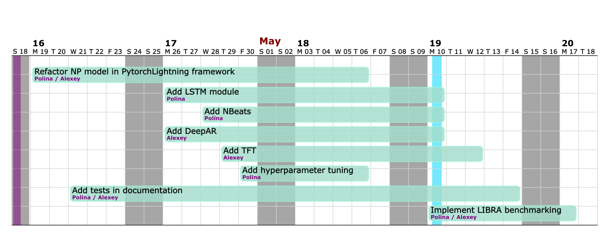

# NeuralProphet project for Theoretical Foundations of DataScience course

This is the repository for NeuralProphet project for Theoretical Foundations of DataScience course.
Contributors are Alexey Voskoboinikov and Polina Pilyugina.
The main aim of this project is to improve NeuralProphet Library.

[Third status report](reports/Third_Status_Report_TFDS.pdf) is contained in the repository.

### Project outline
- **Refactor the code** with **PyTorch Lightning** in accordance with existing API
- Adapt and **include** existing implementations of **SOTA models for time series forecasting** under the NeuralProphet API
- Add **hyperparameter tuning** with Ray Tune as additional module
- Recreate **LIBRA framework for benchmarking** in Python and run it on NeuralProphet and our additionally included models
- Add neccessary **tests and documentation** for introduced functional

### Baseline solutions
The main source of the code of this work is original [NeuralProphet library](https://github.com/ourownstory/neural_prophet).
Firstly, we will refactor the code to support [PyTorch Lightning](https://www.pytorchlightning.ai).
This includes refactoring the model itself and all additional parts.
The main goal of refactoring is to structure the code in a reusable way and separate research modules from engineering parts. 
Additionally, we seek to introduce functional for distributed training from PyTorch Lightning.

For model implementations we will use modules from [PyTorch Forecasting](https://pytorch-forecasting.readthedocs.io/en/latest/index.html).
They are already built in PyTorch Lightning.
We will add data preprocessing steps for these models.
Additionally, we will add wrappers so that these models will rely on the same API and produce results in the same format as NeuralProphet.

For hyperparameter tuning we will introduce a new module using Ray Tune functional.

Additionally, we will add LIBRA framework functional for benchmarking. 
Currently, this framework is available only in R, so we will implement it in python and include in NeuralProphet.
This will allow future users to add datasets and compare results.

## Project structure

### Pytorch Lightning

We refactor existing code of TimeNet and NeuralProphet itself in Pytorch Lightning framework. 
We preserved the full original structure and functionality. 
We have added a new parameter to NeuralProphet which is number of GPUs used for train.
It is supported by Pytorch Lightning Trainer module by default and allows for distributed training on GPUs, which was not originally possible.

In order to install NeuralProphet library, use the following command in the root of repository:
```
pip install .
```

### LSTM
We introduced LSTM model, as a part of additional models modules.
It is based on refactored into Pytorch Lightning LSTM model from pure Pytorch.
For LSTM, the main class has the same functionality as the NeuralProphet and supports all main methods. 
An example of LSTM usage can be foung in `example_notebooks/LSTM_example.ipynb` [notebook](example_notebooks/LSTM_example.ipynb).

Here is the example of using LSTM module:
```
m = LSTM(n_lags = 10,
         n_forecasts=7,
         num_hidden_layers=1,
         d_hidden=64,
         learning_rate=0.1,
         epochs=20)
metrics_df = m.fit(df, freq = '5min')     
future = m.make_future_dataframe(df, preiods = 7, n_historic_predictions=True)
forecast = m.predict(future)
```

### NBeats
We also introduced NBeats model.
It is based on the Pytorch Forecasting model implementation.
We refactored existing model code to support NeuralProphet Metric class.
We also created a new wrapper class, which has the same main modules as NeuralProphet and can be used with the same API.
An example of NBeats usage can be foung in `example_notebooks/NBeats_example.ipynb` [notebook](example_notebooks/NBeats_example.ipynb).

Here is the example of using NBeats module:
```
m = NBeatsNP(n_lags = 10,
             n_forecasts=1,
             epochs = 100,
             auto_lr_find=True)
m.fit(df, freq = '5min')
future = m.make_future_dataframe(df, preiods = 7, n_historic_predictions=10)
forecast = m.predict(future)
```

### DeepAR
We also introduced DeepAR model in the same way as NBeats, as it also was based on Pytorch Forecasting library.
We also refactored existing model code to support NeuralProphet Metric class, in particular training and validation steps.
An example of DeepAR usage can be foung in `example_notebooks/DeepAR_example.ipynb` [notebook](example_notebooks/DeepAR_example.ipynb).

Here is the example of using DeepAR module:
```
m = DeepAR(n_lags = 10,
           n_forecasts=7,
           epochs = 100)
m.fit(df, freq = '5min')
future = m.make_future_dataframe(df, preiods = 7, n_historic_predictions=10)
forecast = m.predict(future)
```

### TFT
We also introduced TFT model. 
It is based on the Pytorch Forecasting model implementation. 
We refactored existing model code to support NeuralProphet Metric class. 
We also created a new wrapper class, which has the same main modules as NeuralProphet 
and can be used with the same API. 
An example of TFT usage can be found in `example_notebooks/TFT_example.ipynb` [notebook](example_notebooks/TFT_example.ipynb).

Here is the example of using NBeats module:

```
m = TFT(n_lags=60,
        n_forecasts=20,
        epochs = 100,
        attention_head_size=1,
        hidden_continuous_size=8)
m.fit(df, freq = '5min')
future = m.make_future_dataframe(df, preiods = 20, n_historic_predictions=10)
forecast = m.predict(future)
```


### Hyperparameter tuning
We introduced a new module for hyperparameter tuning.
It relies on Ray Tune library, as it has an easy integration with Pytorch Lightning models and allows distributed training.
This module is located in `neuralprophet/hyperparameter_tuner.py` [file](example_notebooks/hyperparameter_tuner.py).
It has two modes: auto and manual.
The automated mode runs hyperparameter tuning on predefined by us sets of hyperparameters.
It is useful as a first step for new users and fast tuning.
The manual mode allows users to define their own hyperparameter spaces to tune over. 
In `example_notebooks/hyperparameter_example.ipynb` [notebook](example_notebooks/hyperparameter_example.ipynb) we provide users with a basic example of how to use this module.

Here is an example of hyperparameter optimization usage:
```
best_params, results_df = tune_hyperparameters('NP', df, freq)
```

An example output of this function looks as follows: 
```
{'growth': 'off',
 'n_changepoints': 100,
 'changepoints_range': 0.8,
 'trend_reg': 0.0,
 'yearly_seasonality': False,
 'weekly_seasonality': False,
 'daily_seasonality': False,
 'seasonality_mode': 'additive',
 'seasonality_reg': 0.5,
 'n_lags': 100,
 'd_hidden': 8,
 'num_hidden_layers': 2,
 'ar_sparsity': 0.8,
 'learning_rate': 0.010444235692186717,
 'loss_func': 'Huber',
 'normalize': 'minmax'}
```
It can be used further directly into NeuralProphet configuration initialization.

# LIBRA benchmarking
The dataset we provide in `example_data/LIBRA/` is the dataset on which results are evaluated.
It contains 400 time series from four domains: economics, finance, human, or nature.
We ran benchmarking on part of datasets, as models we want to test are deep and time series in these datasets are mostly large.
In order to run the small version of benchmarking, see the [notebook](example_notebooks/LIBRA_example.ipynb) `example_notebooks/LIBRA_example.ipynb`. 
Small run of LIBRA is also being run during the debagging procedure. 
In order to convert the results into nice latex tables, see the `example_notebooks/evaluation_results.ipynb` [notebook](example_notebooks/evaluation_results.ipynb).
Please, note, that benchmarking takes a lot of time even for small run.

More details on the results of benchmarking are available in our [Third status report](reports/Third_Status_Report_TFDS.pdf).


# Testing the working code

In order to test the code, we have added necessary tests for all new functional into tests module.
It runs automatically with commit, when the library is installed in the dev version.
However, one can always run the debug script to check the pipeline.
In order to do so, use the following command from the root directory of the project
```bash
cd tests
python debug.py
```


## Repository structure:
In this work we follow the original repository structure of NeuralProphet in order to preserve the existing functionality.
Here we present the structure of repository and the files which were changed or added in the process of out project.

``` 
└── neural_prophet
    ├── README.md
    ├── docs
    │   ├── images
    │   ├── model
    │   │   ├── additional_models.md
    │   │   ├── hyperparameter_optimization.md
    │   └── zh
    ├── example_data
    │   ├── LIBRA
    ├── example_notebooks
    │   ├── DeepAR_example.ipynb
    │   ├── LIBRA.ipynb
    │   ├── LSTM_example.ipynb
    │   ├── NBeats_example.ipynb
    │   ├── TFT_example.ipynb
    │   ├── evaluation_results.ipynb
    │   ├── hyperparameter_optimization_example.ipynb
    ├── neuralprophet
    │   ├── dataset
    │   ├── forecasters
    │   │   ├── forecaster.py
    │   │   ├── forecaster_DeepAR.py
    │   │   ├── forecaster_LSTM.py
    │   │   ├── forecaster_NBeats.py
    │   │   ├── forecaster_NBeats_old.py
    │   │   └── forecaster_TFT.py
    │   ├── hyperparameter_tuner.py
    │   ├── libra.py
    │   ├── models
    │   │   ├── DeepAR.py
    │   │   ├── LSTM.py
    │   │   ├── NBeats.py
    │   │   ├── TFT.py
    │   │   └── time_net.py
    │   ├── tools
    │   │   ├── configure.py
    │   │   ├── hdays.py
    │   │   ├── metrics.py
    │   │   ├── metrics_libra.py
    │   │   ├── plot_forecast.py
    │   │   └── plot_model_parameters.py
    │   └── utils
    │       ├── df_utils.py
    │       ├── utils.py
    │       └── utils_torch.py
    ├── notes
    ├── peer_reviews
    ├── reports
    ├── requirements.txt
    ├── results_benchmarking
    │   └── example
    │       ├── results_libra_multistep_economics.csv
    │       ├── results_libra_multistep_finance.csv
    │       ├── results_libra_multistep_human.csv
    │       ├── results_libra_multistep_nature.csv
    │       ├── results_libra_onestep_economics.csv
    │       ├── results_libra_onestep_finance.csv
    │       ├── results_libra_onestep_human.csv
    │       └── results_libra_onestep_nature.csv
    ├── roadmap_gantt.png
    ├── scripts
    ├── setup.py
    └── tests
        ├── debug.py
        └── test_integration.py

``` 

## Distribution of roles and roadmap
We distributed our main tasks and goals evenly, as described on the roadmap. 
Both of us were working on refactoring into PyTorch Lightning.
Alexey focused on the main TimeNet model class, while Polina worked on the forecaster code.
We also distributed addition of models, such that Polina implemented on N-Beats and LSTM, while Alexey implemented Temporal Fusion Transformers and DeepAR.
We both have writen corresponding tests and documentation of implemented modules.
Further, Polina focused on hyperparameter tuning addition, while Alexey implemented LIBRA framework in python.
Afterwards, we both worked on the benchmarking using LIBRA framework and finalization of the project.

At a current stage, we have finished all the aims that were set for the project.
The only bottleneck that we encountered was the computational intensity of benchmarking, therefore we completed benchmarking only on sample from all time series available.

<center>

</center>
