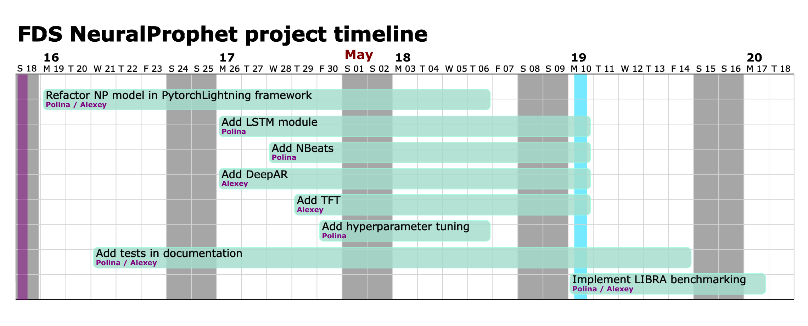

# NeuralProphet project for Theoretical Foundations of DataScience course

---
This is the repository for NeuralProphet project for Theoretical Foundations of DataScience course.
Contributors are Alexey Voskoboinikov and Polina Pilyugina.
The main aim of this project is to improve NeuralProphet Library.

[Report](Report_TFDS.pdf) is contained in the repository.

### Project outline
- **Refactor the code** with **PyTorch Lightning** in accordance with existing API
- Adapt and **include** existing implementations of **SOTA models for time series forecasting** under the NeuralProphet API
- Add **hyperparameter tuning** with Ray Tune as additional module
- Recreate **LIBRA framework for benchmarking** in Python and run it on NeuralProphet and our additionally included models
- Add neccessary **tests and documentation** for introduced functional

### Baseline solutions
The main source of the code of this work is original [NeuralProphet library](https://github.com/ourownstory/neural_prophet).
Firstly, we will refactor the code to support [PyTorch Lightning](https://www.pytorchlightning.ai).
This includes refactoring the model itself and all additional parts.
The main goal of refactoring is to structure the code in a reusable way and separate research modules from engineering parts. 
Additionally, we seek to introduce functional for distributed training from PyTorch Lightning.

For model implementations we will use modules from [PyTorch Forecasting](https://pytorch-forecasting.readthedocs.io/en/latest/index.html).
They are already built in PyTorch Lightning.
We will add data preprocessing steps for these models.
Additionally, we will add wrappers so that these models will rely on the same API and produce results in the same format as NeuralProphet.

For hyperparameter tuning we will introduce a new module using Ray Tune functional.

Additionally, we will add LIBRA framework functional for benchmarking. 
Currently, this framework is available only in R, so we will implement it in python and include in NeuralProphet.
This will allow future users to add datasets and compare results.


## Repository structure:
In this work we follow the original repository structure of NeuralProphet in order to preserve the existing functionality.
Here we present the structure of repository and the files which were changed or added in the process of out project.

``` 
├── LICENSE
├── MANIFEST.in
├── README.md
├── README_old.md
├── Report_TFDS.pdf
├── docs
├── example_data
├── example_notebooks
│   ├── LSTM_example.ipynb
│   ├── NBeats_example.ipynb
│   ├── hyperparameter_example.ipynb
├── neuralprophet
│   ├── __init__.py
│   ├── additional_models.py
│   ├── configure.py
│   ├── forecaster.py
│   ├── forecaster_additional_models.py
│   ├── hyperparameter_tuner.py
├── notes
├── peer_reviews
│   ├── First_peer_review_report_Cohortney.pdf
│   ├── First_peer_review_report_FES.pdf
│   └── First_peer_review_report_MMDF.pdf
├── project_notebooks
│   ├── lightning_functionlity_check.ipynb
│   ├── nbeats.ipynb
│   ├── new_models.ipynb
│   └── new_models_1.ipynb
├── pyproject.toml
├── requirements.txt
├── roadmap.png
├── scripts
├── setup.py
├── test_lightning.py
└── tests
    ├── debug.py
    ├── test_integration.py
    └── test_unit.py
``` 

## Distribution of roles and roadmap
We distributed our main tasks and goals evenly, as described on the roadmap below. 
Both of us will work on refactoring into PyTorch Lightning.
Alexey will focus on the main TimeNet model class, while Polina will work on the forecaster code.
We also distributed models we aim to add.
Polina will work on N-Beats and LSTM, while Alexey will work on Temporal Fusion Transformers and DeepAR.
We will write corresponding tests and documentation of implemented modules.
Further, Polina will focus on hyperparameter tuning addition, while Alexey will implement LIBRA framework in python.
Afterwards, we will both work on the benchmarking using LIBRA framework and finalization of the project.



